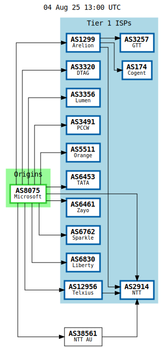
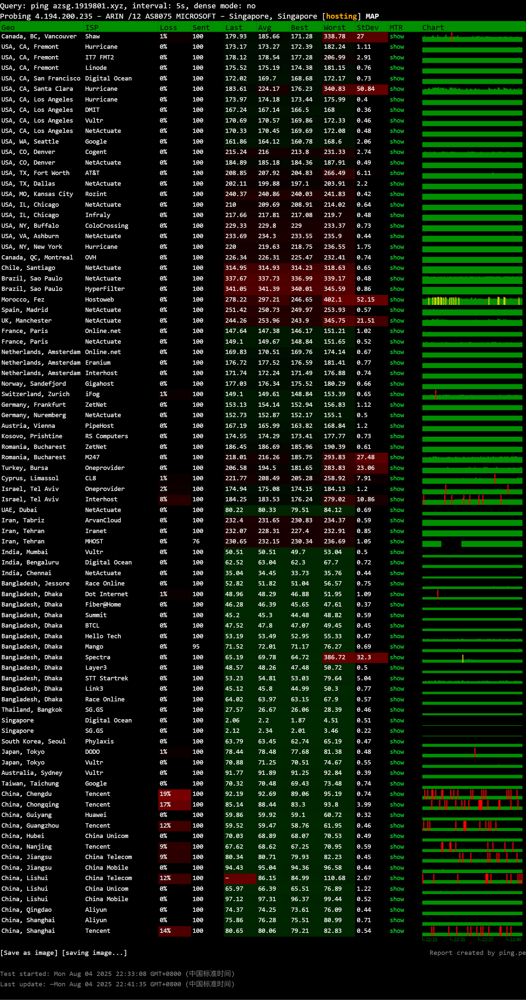

简评:三网直连,速度优秀,部分流媒体解锁,广播机房IP,[探针](https://nezha.1919801.xyz/server/1)

<!-- more -->
## 系统基础信息
| 项目 | 值 |
|------|------|
| CPU型号 | AMD EPYC 7763 64-Core Processor @ 3244.906 MHz |
| CPU数量 | 2 Physical CPU(s) |
| CPU缓存 | L1: 64 KB / L2: 512 KB / L3: 32 MB |
| AES-NI | ✔️ Enabled |
| VM-x/AMD-V/Hyper-V | ✔️ Enabled |
| 内存 | 445.05 MB / 898.09 MB |
| 硬盘空间 | 2.17 GB / 60.95 GB [3.6%] |
| 启动盘路径 | /dev/sda1 |
| 系统 | ubuntu 24.04 [x86_64] |
| 内核 | 6.11.0-1018-azure |
| 系统在线时间 | 0 days, 00 hours, 08 minutes |
| 时区 | UTC |
| 负载 | 1.35 / 0.63 / 0.23 |
| 虚拟化架构 | Microsoft Hyper-V |
| NAT类型 | Port Restricted Cone |
| TCP加速方式 | cubic |

## IP信息
| 类型 | ASN | 位置 | 其他信息 |
|------|------|------|------|
| IPv4 | AS8075 MICROSOFT-CORP-MSN-AS-BLOCK | Singapore/Singapore | Active IPs: 26/256 (subnet /24)<br>121824/1048576 (prefix /12) |
| IPv6 | AS8075 MICROSOFT-CORP-MSN-AS-BLOCK | Singapore/Singapore | 子网掩码: /128 |

## 性能测试
### CPU性能
| 测试类型 | 得分 |
|----------|------|
| 单线程测试 | 824 Scores |

### 内存性能
| 测试类型 | 速度 |
|----------|------|
| 单线程读测试 | 16078.21 MB/s |
| 单线程写测试 | 13381.67 MB/s |

### 磁盘性能
#### dd测试
| 测试操作 | 写速度 | 读速度 |
|----------|--------|--------|
| 100MB-4K Block | 5.1 MB/s (1235 IOPS) | 5.1 MB/s (1236 IOPS) |
| 1GB-1M Block | 56.8 MB/s (54 IOPS) | 56.4 MB/s (53 IOPS) |

#### fio测试
| 块大小 | 读速度 (IOPS) | 写速度 (IOPS) | 总速度 |
|--------|---------------|---------------|--------|
| 4k | 2.45 MB/s (614) | 2.47 MB/s (618) | 4.92 MB/s (1.2k) |
| 64k | 27.37 MB/s (427) | 27.77 MB/s (434) | 55.15 MB/s (861) |
| 512k | 26.64 MB/s (52) | 28.50 MB/s (55) | 55.14 MB/s (107) |
| 1m | 26.28 MB/s (25) | 28.84 MB/s (28) | 55.13 MB/s (53) |

## 流媒体解锁测试
### Netflix
| 协议 | 状态 | 识别信息 |
|------|------|----------|
| IPv4 | 完整解锁 | 地区：新加坡 |
| IPv6 | 无服务 | - |

### YouTube
| 协议 | 连接方式 | 缓存节点 | 识别地域 |
|------|----------|----------|----------|
| IPv4 | YouTube Video Server | 新加坡/樟宜 (SIN11S18) | 新加坡(SG) |
| IPv6 | 无服务 | - | - |

### DisneyPlus
| 协议 | 状态 |
|------|------|
| IPv4 | 当前出口地区即将开通 |
| IPv6 | 无服务 |

### TikTok解锁
| 协议 | 地区 |
|------|------|
| IPv4 | 【SG】 |

### 跨国流媒体解锁 (IPv4)
| 服务平台 | 解锁状态 | 详细信息 |
|----------|----------|----------|
| Disney+ | ❌ | IP Banned |
| Netflix | ✅ | 仅限原创内容 |
| YouTube Premium | ✅ | Region: SG |
| Amazon Prime Video | ✅ | Region: SG |
| TVBAnywhere+ | ✅ |  |
| Spotify Registration | ❌ |  |
| ChatGPT | ✅ |  |
| Google Gemini | ✅ | Region: SGP |
| Claude | ✅ |  |
| Steam Currency | SGD |  |
| Reddit | ❌ |  |

## IP质量检测 (IPv4)
### 安全评分
| 指标 | 得分 | 数据库来源 |
|------|------|------------|
| 声誉 | 0 | [2] |
| 信任得分 | 0 | [8] |
| VPN得分 | 100 | [8] |
| 代理得分 | 100 | [8] |
| 威胁得分 | 100 | [8] |
| 欺诈得分 | 65 [E], 8 [1] |  |
| 滥用得分 | 0 | [3] |
| ASN滥用得分 | 0.0002 (Very Low) | [A] |
| 公司滥用得分 | 0.0009 (Low) | [A] |
| 威胁级别 | low | [9] |

### 安全信息
| 属性 | 结果 | 数据库来源 |
|------|------|------------|
| 使用类型 | DataCenter/WebHosting/Transit [3], hosting [0 7 8 9 A] |  |
| 公司类型 | hosting | [0 7 A] |
| 云提供商 | Yes | [7] |
| 数据中心 | Yes | [0 1 5 6 8 A] |
| 代理 | Yes | [E] |
| VPN | Yes | [A E] |
| **DNS黑名单** | **314(总检测)** |  |
| 清洁 | 0 |  |
| 黑名单 | 7 |  |
| 其他 | 6 |  |

## 国际互连
### ISP

### 全球ping

## 三网回程线路
### IPv4线路
| 目标节点 | 线路信息 |
|----------|----------|
| 北京电信v4 | 电信163 [普通线路] |
| 北京联通v4 | 联通4837 [普通线路] |
| 北京移动v4 | 移动CMI [普通线路] |
| 上海电信v4 | 电信163 [普通线路] |
| 上海联通v4 | 联通4837 [普通线路] |
| 广州电信v4 | 电信163 [普通线路] |
| 广州联通v4 | 联通4837 [普通线路] |
| 广州移动v4 | 移动CMI [普通线路] |
| 成都电信v4 | 电信163 [普通线路] |
| 成都联通v4 | 联通4837 [普通线路] |
| 成都移动v4 | 移动CMI [普通线路] |

## 去程路由追踪
### 广州电信
```
5ms AS4134	骨干网/电信
7ms AS4134	骨干网/电信
54ms AS4134	新加坡/电信163
53ms AS8075 骨干网/microsoft.com
51ms AS8075 新加坡/microsoft.com
```
### 广州联通
```
4ms AS134543	中国/广东/东莞/联通
14ms AS4837 骨干网/联通	
12ms AS4837	骨干网/联通
46ms AS4837 新加坡/骨干网/联通
51ms AS4837	新加坡/骨干网/联通
52ms AS8075	骨干网/microsoft.com
53ms AS8075 新加坡/microsoft.com
```
### 广州移动
```
8ms AS56040	 中国/广东/广州/移动
11ms AS56040 中国/广东/广州/移动
18ms AS9808	骨干网/移动
21ms AS58453 骨干网/移动
60ms AS58453 新加坡/骨干网/移动
51ms AS8075 骨干网/microsoft.com
53ms AS8075 新加坡/microsoft.com
```
## 回程路由追踪
### 广州电信
```
广州电信 58.60.188.222
1.42 ms 	AS8075 [MSFT] 新加坡 microsoft.com
45.77 ms 	AS4134 [CHINANET-BB] 中国 广东 广州 www.chinatelecom.com.cn 电信
52.41 ms 	AS134774 [CHINANET-GD] 中国 广东 深圳 chinatelecom.cn 电信
```

### 广州联通
```
广州联通 210.21.196.6
2.41 ms 	AS8075 [MSFT] 新加坡 microsoft.com
2.15 ms 	AS4837 [CU169-BACKBONE] 新加坡 chinaunicom.cn 联通
40.76 ms 	AS4837 [CU169-BACKBONE] 中国 广东 广州 chinaunicom.cn 联通
38.94 ms 	AS4837 [CU169-BACKBONE] 中国 广东 广州 X-I chinaunicom.cn 联通
104.72 ms 	AS17623 [APNIC-AP] 中国 广东 深圳 chinaunicom.cn 联通
48.01 ms 	AS17623 中国 广东 深圳 宝安区 chinaunicom.cn 联通
```

### 广州移动
```
广州移动 120.196.165.24
7.59 ms 	AS8075 [MSFT] 新加坡 microsoft.com
2.95 ms 	AS58453 [CMI-INT] 新加坡 CMI-SG-PoP cmi.chinamobile.com 移动
40.46 ms 	AS58453 [CMI-INT] 中国 广东 广州 cmi.chinamobile.com 移动
42.74 ms 	AS9808 [CMNET] 中国 广东 广州 X-I chinamobileltd.com 移动
42.19 ms 	AS9808 [CMNET] 中国 广东 广州 I-C chinamobileltd.com 移动
45.58 ms 	AS9808 [CMNET] 中国 广东 广州 chinamobileltd.com 移动
96.89 ms 	AS9808 [CMNET] 中国 广东 广州 chinamobileltd.com 移动
46.52 ms 	AS56040 [APNIC-AP] 中国 广东 深圳 gd.10086.cn 移动
```

## 速度测试
| 位置 | 上传速度 | 下载速度 | 延迟 |
|------|----------|----------|------|
| Speedtest.net | 949.48 Mbps | 1680.38 Mbps | 1.64 ms |
| 新加坡 | 931.72 Mbps | 1614.59 Mbps | 2.67 ms |
| 中国香港 | 214.91 Mbps | 349.83 Mbps | 34.39 ms |

<style>
  table {
    width: 100%;
    border-collapse: collapse;
    margin: 1em 0;
    font-size: 0.9em;
  }
  th, td {
    border: 1px solid #ddd;
    padding: 8px;
    text-align: left;
  }
  th {
    background-color: #f2f2f2;
    font-weight: bold;
  }
  tr:nth-child(even) {
    background-color: #f9f9f9;
  }
  pre {
    background-color: #f5f5f5;
    padding: 15px;
    border-radius: 5px;
    overflow-x: auto;
  }
  .success {
    color: #2ecc71;
    font-weight: bold;
  }
  .warning {
    color: #f39c12;
    font-weight: bold;
  }
  .error {
    color: #e74c3c;
    font-weight: bold;
  }
</style>
