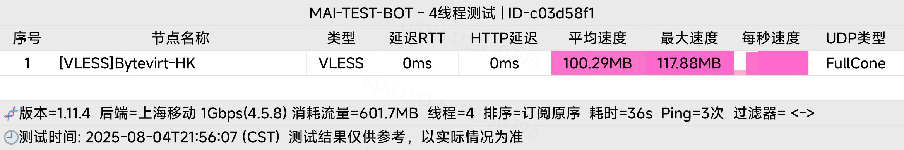

移动直连,其他绕美,流媒体解锁,广播机房IP,[探针](https://nezha.1919801.xyz/server/3)

<!-- more -->
## 基础信息
| 项目                | 结果                              |
|---------------------|-----------------------------------|
| CPU 型号           | AMD EPYC 7551 32-Core Processor   |
| CPU 核心数         | 1                                 |
| CPU 频率           | 1996.249 MHz                      |
| CPU 缓存           | L1: 64.00 KB / L2: 512.00 KB / L3: 16.00 MB |
| AES-NI指令集       | ✔ Enabled                         |
| VM-x/AMD-V支持     | ✔ Enabled                         |
| 内存               | 276.56 MiB / 467.89 MiB           |
| Swap               | 未检测到                          |
| 硬盘空间           | 2.78 GiB / 4.67 GiB               |
| 启动盘路径         | `/dev/vda1`                       |
| 系统在线时间       | 0 days, 14 hour 24 min            |
| 负载               | 1.54, 0.69, 0.31                 |
| 系统               | Ubuntu 22.04 LTS (x86_64)        |
| 架构               | x86_64 (64 Bit)                   |
| 内核               | 5.15.0-39-generic                 |
| TCP加速方式        | bbr                               |
| 虚拟化架构         | KVM                               |
| NAT类型            | Full Cone                         |
| IPV4 ASN           | AS62711 Maxwell Telecom LLC       |
| IPV4 位置          | Hong Kong / Hong Kong / HK        |

---

## 性能测试
### CPU (sysbench)
- **单线程测试得分**: 1187 Scores  

### 内存 (Fast Mode)
| 测试项         | 速度          |
|---------------|--------------|
| 单线程读测试   | 29765.66 MB/s |
| 单线程写测试   | 12388.83 MB/s |

### 磁盘 IO
#### dd 测试
| 测试操作        | 写速度                         | 读速度                          |
|---------------|-------------------------------|--------------------------------|
| 100MB-4K Block | 14.1 MB/s (3431 IOPS, 7.46s) | 50.3 MB/s (12273 IOPS, 2.09s) |
| 1GB-1M Block   | 915 MB/s (872 IOPS, 1.15s)    | 6.0 GB/s (5757 IOPS, 0.17s)   |

#### fio 测试
测试失败（建议替换方式）

---

## 流媒体解锁
### Netflix
- **IPv4**: 完整解锁（支持非自制剧），识别地区：中国香港  
- **IPv6**: 未正常配置  

### YouTube
- **IPv4/IPv6**:  
  - 连接方式: YouTube Video Server  
  - 缓存节点: 中国香港 (HKG07S42)  
  - 识别地区: 中国香港 (HK)  

### DisneyPlus
- **IPv4/IPv6**: 当前出口即将开通 DisneyPlus  

### 多平台解锁检测 (RegionRestrictionCheck)
| 服务               | IPv4 状态       |
|--------------------|----------------|
| Disney+            | ✔ Yes (Region: HK) |
| Netflix            | ✔ Yes (Region: HK) |
| YouTube Premium    | ✔ Yes (Region: HK) |
| Amazon Prime Video | ✔ Yes (Region: HK) |
| Spotify            | ✔ Yes (Region: HK) |
| Reddit             | ✔ Yes             |
| ChatGPT            | ✘ No (仅限移动端) |

### TikTok
- **地区检测**: Failed  

---

## 网络质量
### IP 安全检测
| 指标              | 得分/状态        | 数据来源        |
|-------------------|----------------|---------------|
| 信任得分          | 93             | [8] ipdata    |
| VPN得分           | 3              | [8] ipdata    |
| 代理得分          | 16             | [8] ipdata    |
| 欺诈得分          | 0              | [1][E]        |
| 数据中心          | ✔ Yes          | [0][7]        |
| 代理/VPN/Tor      | ✘ No           | 多数据库确认   |
| Google搜索可行性  | ✘ NO           |               |

### 邮件端口检测
| 平台       | SMTP  | SMTPS | POP3  | POP3S | IMAP  | IMAPS |
|------------|-------|-------|-------|-------|-------|-------|
| LocalPort  | ✔     | ✔     | ✔     | ✔     | ✔     | ✔     |
| QQ         | ✔     | ✔     | ✔     | ✘     | ✔     | ✘     |
| Gmail      | ✘     | ✘     | ✘     | ✘     | ✘     | ✘     |

---
## 国际互连
### ISP

### 全球ping

## 去程路由
### 广州电信
| 跳数 | IP | PTR | 地理位置/仅供参考 | AS | 丢包率 | 发包 | 最新(ms) | 最快(ms) | 最慢(ms) | 平均(ms) |
|---|---|---|---|---|---|---|---|---|---|---|
| 1 | -- | -- | -- | -- | 100% | 33 | * | -- | -- | -- |
| 2 | 192.168.233.2 | -- | 局域网 | -- | 55% | 47 | 3 | 1 | 46 | 11 |
| 3 | 172.30.0.1 | -- | 局域网 | -- | 0% | 99 | 4 | <1 | 16 | 3 |
| 4 | 172.31.54.6 | -- | 局域网 | -- | 59% | 46 | 15 | 3 | 24 | 8 |
| 5 | 172.17.31.205 | -- | 局域网 | -- | 0% | 100 | 3 | 1 | 20 | 6 |
| 6 | 192.168.1.17 | -- | 局域网 | -- | 0% | 100 | 3 | 1 | 25 | 5 |
| 7 | -- | -- | -- | -- | 100% | 33 | * | -- | -- | -- |
| 8 | -- | -- | -- | -- | 100% | 33 | * | -- | -- | -- |
| 9 | 14.215.42.61 | -- | 中国/广东/广州/电信 | AS4134 | 13% | 80 | 8 | 2 | 17 | 6 |
| 10 | 113.96.6.153 | -- | 中国/广东/广州/电信 | AS4134 | 0% | 100 | 11 | 1 | 21 | 6 |
| 11 | 113.96.5.189 | -- | 中国/广东/广州/电信 | AS4134 | 86% | 37 | * | 3 | 12 | 5 |
| 12 | 202.97.71.250 | -- | 骨干网/电信 | AS4134 | 27% | 64 | * | 2 | 18 | 5 |
| 13 | 202.97.94.90 | -- | 骨干网/电信 | AS4134 | 19% | 73 | * | 3 | 16 | 6 |
| 14 | 202.97.43.86 | -- | 骨干网/电信 | AS4134 | 0% | 100 | 161 | 160 | 292 | 167 |
| 15 | 218.30.53.87 | -- | 美国/加利福尼亚/洛杉矶 | AS4134 | 0% | 100 | 160 | 160 | 168 | 160 |
| 16 | 63.218.126.42 | Fh0-0-0-24.br07.hkg12.as34... | 骨干网/pccw.com | AS3491 | 10% | 83 | 181 | 177 | 184 | 177 |
| 17 | 17 | -- | -- | -- | 100% | 33 | * | -- | -- | -- |
| 18 | 10.19.81.1 | -- | 局域网 | -- | 14% | 77 | 325 | 317 | 331 | 325 |
| 19 | 23.175.201.209 | -- | 美国 | AS62711 | 0% | 100 | 314 | 314 | 319 | 314 |
### 广州联通
| 跳数 | IP | PTR | 地理位置/仅供参考 | AS | 丢包率 | 发包 | 最新(ms) | 最快(ms) | 最慢(ms) | 平均(ms) |
|---|---|---|---|---|---|---|---|---|---|---|
| 1 | 27.44.127.129 | -- | 中国/广东/广州/联通 | AS134543 | 0% | 100 | 2 | 1 | 12 | 4 |
| 2 | 192.168.66.5 | -- | 局域网 | -- | 0% | 100 | 2 | 1 | 14 | 5 |
| 3 | 172.20.0.1 | -- | 局域网 | -- | 0% | 100 | 4 | 2 | 15 | 4 |
| 4 | 10.128.16.21 | -- | 局域网 | -- | 47% | 53 | 6 | 4 | 185 | 13 |
| 5 | 29.18.226.144 | -- | 美国 | AS749 | 0% | 100 | 4 | 2 | 20 | 4 |
| 6 | 29.18.226.144 | -- | 美国 | AS749 | 0% | 100 | 2 | 2 | 12 | 3 |
| 7 | 30.1.157.149 | -- | 美国 | AS749 | 95% | 37 | * | 3 | 8 | 5 |
| 8 | 23.175.201.209 | -- | 美国 | AS62711 | 0% | 100 | 350 | 348 | 354 | 348 |
### 广州移动
| 跳数 | IP | PTR | 地理位置/仅供参考 | AS | 丢包率 | 发包 | 最新(ms) | 最快(ms) | 最慢(ms) | 平均(ms) |
|---|---|---|---|---|---|---|---|---|---|---|
| 1 | 183.232.3.1 | -- | 中国/广东/广州/移动 | AS56040 | 0% | 100 | 11 | 2 | 141 | 8 |
| 2 | 172.20.1.1 | -- | 局域网 | -- | 3% | 94 | 5 | 1 | 28 | 9 |
| 3 | 192.168.88.46 | -- | 局域网 | -- | 4% | 92 | 10 | 1 | 39 | 9 |
| 4 | 10.12.0.1 | -- | 局域网 | -- | 0% | 100 | 6 | 1 | 26 | 9 |
| 5 | 211.136.242.125 | -- | 中国/广东/广州/移动 | AS56040 | 0% | 100 | 6 | 4 | 31 | 9 |
| 6 | 221.183.39.173 | -- | 骨干网/移动 | AS9808 | 97% | 34 | * | 11 | 11 | 11 |
| 7 | 111.24.5.197 | -- | 中国/广东/广州/移动 | AS9808 | 5% | 91 | * | 7 | 27 | 12 |
| 8 | 221.183.89.189 | -- | 骨干网/移动 | AS9808 | 0% | 100 | 17 | 14 | 29 | 17 |
| 9 | 221.183.89.210 | -- | 骨干网/移动 | AS9808 | 0% | 100 | 12 | 6 | 28 | 10 |
| 10 | 221.183.92.162 | -- | 骨干网/移动 | AS9808 | 0% | 100 | 13 | 8 | 24 | 11 |
| 11 | 223.120.141.66 | -- | 骨干网/移动 | AS58807 | 0% | 100 | 19 | 16 | 30 | 19 |
| 12 | 223.120.131.2 | -- | 骨干网/移动 | AS58807 | 0% | 100 | 10 | 10 | 28 | 12 |
| 13 | 13 | -- | -- | -- | 100% | 34 | * | -- | -- | -- |
| 14 | 14 | -- | -- | -- | 100% | 34 | * | -- | -- | -- |
| 15 | 23.175.201.209 | -- | 美国 | AS62711 | 0% | 100 | 18 | 18 | 32 | 19 |
## 回程路由
### 三网回程
| 目标节点       | 线路类型       |
|---------------|---------------|
| 北京电信      | 电信163 [普通线路] |
| 北京联通      | 联通4837 [普通线路] |
| 上海电信      | 电信163 [普通线路] |
| 广州联通      | 联通4837 [普通线路] |

### 详细路由追踪
#### 广州电信 58.60.188.222
```plaintext
5.83 ms 	AS62711 北美地区 Maxwell Telecom LLC
0.81 ms 	AS8075 法国 法兰西岛大区 巴黎 microsoft.com
1.13 ms 	AS174 [COGENT-BONE] 中国 香港 cogentco.com
2.08 ms 	AS174 [COGENT-BONE] 中国 香港 cogentco.com
151.58 ms 	AS174 [COGENT-BONE] 美国 加利福尼亚 洛杉矶 cogentco.com
168.92 ms 	AS174 [COGENT-BONE] 美国 加利福尼亚 洛杉矶 cogentco.com
202.90 ms 	AS174 [COGENT-BONE] 美国 加利福尼亚 圣何塞 cogentco.com
151.60 ms 	AS174 [COGENT-BONE] 美国 加利福尼亚 圣何塞 cogentco.com
324.26 ms 	AS174 美国 加利福尼亚 圣克拉拉 cogentco.com
409.06 ms 	AS4134 [CHINANET-BB] 中国 广东 广州 www.chinatelecom.com.cn 电信
320.91 ms 	AS134774 [CHINANET-GD] 中国 广东 深圳 chinatelecom.cn 电信
```
#### 广州联通 210.21.196.6
```plaintext
4.81 ms 	AS62711 北美地区 Maxwell Telecom LLC
0.52 ms 	AS8075 法国 法兰西岛大区 巴黎 microsoft.com
1.37 ms 	AS174 [COGENT-BONE] 中国 香港 cogentco.com
2.20 ms 	AS174 [COGENT-BONE] 中国 香港 cogentco.com
151.87 ms 	AS174 [COGENT-BONE] 美国 加利福尼亚 洛杉矶 cogentco.com
145.68 ms 	AS174 [COGENT-BONE] 美国 加利福尼亚 洛杉矶 cogentco.com
337.01 ms 	AS174 美国 加利福尼亚 洛杉矶 cogentco.com
338.90 ms 	AS4837 [CU169-BACKBONE] 中国 广东 广州 chinaunicom.cn 联通
315.37 ms 	AS4837 [CU169-BACKBONE] 中国 广东 广州 X-I chinaunicom.cn 联通
* ms 	AS17816 [UNICOM-GD] 中国 广东省 广州市 chinaunicom.cn 联通
317.41 ms 	AS17623 [APNIC-AP] 中国 广东 深圳 chinaunicom.cn 联通
339.84 ms 	AS17623 中国 广东 深圳 宝安区 chinaunicom.cn 联通
```
#### 广州移动 120.196.165.24
```plaintext
4.71 ms 	AS62711 北美地区 Maxwell Telecom LLC
0.63 ms 	AS8075 法国 法兰西岛大区 巴黎 microsoft.com
2.28 ms 	AS3356 中国 香港 lumen.com
7.17 ms 	AS9808 [CMNET] 中国 广东 广州 X-I chinamobileltd.com 移动
8.93 ms 	AS9808 [CMNET] 中国 广东 广州 I-C chinamobileltd.com 移动
8.74 ms 	AS9808 [CMNET] 中国 广东 广州 chinamobileltd.com 移动
10.41 ms 	AS9808 [CMNET] 中国 广东 广州 chinamobileltd.com 移动
11.33 ms 	AS9808 [CMNET] 中国 广东 广州 chinamobileltd.com 移动
10.50 ms 	AS56040 [APNIC-AP] 中国 广东 深圳 gd.10086.cn 移动
```

## 网络测速
| 位置         | 上传速度     | 下载速度     | 延迟       |
|--------------|-------------|-------------|-----------|
| Speedtest.net| 576.09 Mbps | 925.13 Mbps | 976.08 ms |
| 中国香港     | 95.23 Mbps  | 88.30 Mbps  | 3.81 ms   |
| 新加坡       | 71.90 Mbps  | 236.64 Mbps | 31.33 ms  |