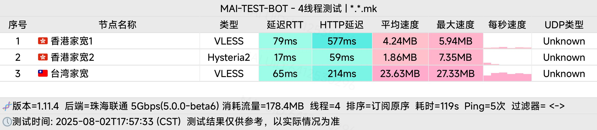
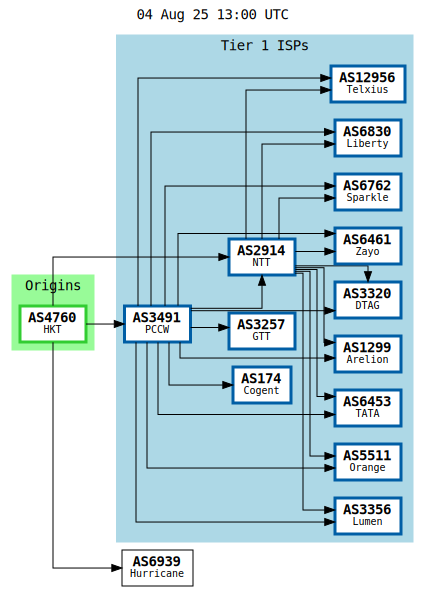
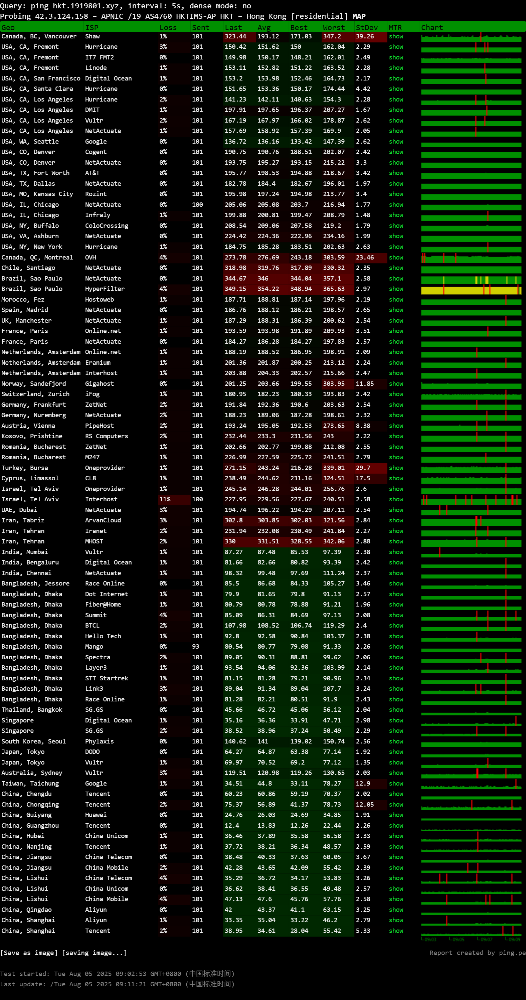

三网直连,流媒体解锁,IP质量优秀,平峰期延迟低

::: warning

实测速度极慢,晚高峰ping可达300ms+

:::
<!-- more -->
## IP质量检测
### IPv4安全评分
| 指标 | 得分 | 数据库来源 |
|------|------|------------|
| 声誉(越高越好) | 0 | [2] |
| 信任得分(越高越好) | 36 | [8] |
| VPN得分(越低越好) | 0 | [8] |
| 代理得分(越低越好) | 96 | [8] |
| 社区投票-无害 | 0 | [2] |
| 社区投票-恶意 | 0 | [2] |
| 威胁得分(越低越好) | 98 | [8] |
| 欺诈得分(越低越好) | 3 [1], 0 [E] | [1][E] |
| 滥用得分(越低越好) | 0 | [3] |
| ASN滥用得分 | 0.0006 (Low) | [A] |
| 公司滥用得分 | 0.0019 (Low) | [A] |
| 威胁级别 | low | [9] |

### IPv4黑名单记录
| 类型 | 数量 | 数据库来源 |
|------|------|------------|
| 无害记录 | 0 | [2] |
| 恶意记录 | 0 | [2] |
| 可疑记录 | 0 | [2] |
| 无记录 | 94 | [2] |
| **DNS黑名单** | **314(总检测)** |  |
| 清洁 | 0 |  |
| 黑名单 | 5 |  |
| 其他 | 24 |  |

### IPv4安全信息
| 属性 | 结果 | 数据库来源 |
|------|------|------------|
| 使用类型 | unknown [C], corporate [9], isp [0 7 A], FixedLineISP [3], business [8] |  |
| 公司类型 | isp | [0 7 A] |
| 云提供商 | No | [7] |
| 数据中心 | No | [0 1 5 6 8 A C] |
| 移动设备 | No [5 A C], Yes [E] |  |
| 代理 | No | [0 1 4 5 6 7 8 9 A C E] |
| VPN | No | [0 1 6 7 A C E] |
| Tor出口 | No | [1 7] |
| 网络爬虫 | No | [9 A E] |

### IPv6安全评分
| 指标 | 得分 | 数据库来源 |
|------|------|------------|
| 欺诈得分 | 0 | [1] |
| 滥用得分 | 0 | [3] |
| ASN滥用得分 | 0.005 (Low) | [A] |
| 公司滥用得分 | 0 (Very Low) | [A] |

### IPv6安全信息
| 属性 | 结果 | 数据库来源 |
|------|------|------------|
| 使用类型 | hosting [A], DataCenter/WebHosting/Transit [3] |  |
| 公司类型 | hosting | [A] |
| 数据中心 | Yes | [1 A] |
| 移动设备 | No | [A] |
| **DNS黑名单** | **314(总检测)** |  |
| 清洁 | 0 |  |
| 黑名单 | 0 |  |
| 其他 | 314 |  |
## 国际互连
### ISP

### 全球ping

## 三网去程路由
### 广州电信
| 跳数 | IP | PTR | 地理位置 / 仅供参考 | AS | 丢包率 | 发包 | 最新(ms) | 最快(ms) | 最慢(ms) | 平均(ms) |
|---|---|---|---|---|---|---|---|---|---|---|
| 1 | -- | -- | -- | -- | 100% | 36 | * | -- | -- | -- |
| 2 | 192.168.233.2 | -- | 局域网 | -- | 27% | 67 | 5 | 1 | 42 | 7 |
| 3 | 172.30.0.1 | -- | 局域网 | -- | 0% | 100 | 4 | <1 | 18 | 4 |
| 4 | 172.31.52.6 | -- | 局域网 | -- | 27% | 67 | 3 | 2 | 43 | 8 |
| 5 | 172.17.31.201 | -- | 局域网 | -- | 8% | 86 | 8 | 2 | 19 | 6 |
| 6 | 192.168.1.25 | -- | 局域网 | -- | 0% | 100 | 8 | 2 | 31 | 6 |
| 7 | -- | -- | -- | -- | 100% | 36 | * | -- | -- | -- |
| 8 | -- | -- | -- | -- | 100% | 36 | * | -- | -- | -- |
| 9 | 14.215.42.73 | -- | 中国/广东/广州/电信 | AS4134 | 74% | 43 | 6 | 3 | 12 | 5 |
| 10 | 121.14.14.45 | -- | 中国/广东/广州/电信 | AS4134 | 0% | 100 | 8 | 1 | 22 | 8 |
| 11 | 113.96.4.53 | -- | 中国/广东/广州/电信 | AS4134 | 79% | 42 | * | 3 | 13 | 6 |
| 12 | 202.97.71.254 | -- | 骨干网/电信 | AS4134 | 53% | 53 | * | 3 | 14 | 6 |
| 13 | 202.97.94.114 | -- | 骨干网/电信 | AS4134 | 17% | 77 | 4 | 3 | 22 | 6 |
| 14 | 202.97.95.174 | -- | 骨干网/电信 | AS4134 | 15% | 78 | 8 | 8 | 18 | 9 |
| 15 | 202.97.122.118 | -- | 骨干网/电信 | AS4134 | 0% | 100 | 8 | 8 | 22 | 9 |
| 16 | 63.218.211.18 | netvigator-tenge0-2-0-7.br03... | 中国/香港/pccw.com | AS3491 | 1% | 99 | 9 | 8 | 21 | 9 |
| 17 | -- | -- | -- | -- | 100% | 36 | * | -- | -- | -- |
| 18 | -- | -- | -- | -- | 100% | 36 | * | -- | -- | -- |
| 19 | 42.3.124.158 | -- | 中国/香港/pccw.com | AS4760 | 1% | 98 | 17 | 10 | 23 | 11 |
### 广州联通
| 跳数 | IP | PTR | 地理位置 / 仅供参考 | AS | 丢包率 | 发包 | 最新(ms) | 最快(ms) | 最慢(ms) | 平均(ms) |
|---|---|---|---|---|---|---|---|---|---|---|
| 1 | 27.44.127.129 | -- | 中国/广东/广州/联通 | AS134543 | 0% | 100 | 4 | 1 | 11 | 4 |
| 2 | 192.168.66.5 | -- | 局域网 | -- | 0% | 100 | 4 | 1 | 11 | 4 |
| 3 | 172.20.0.1 | -- | 局域网 | -- | 0% | 100 | 4 | 2 | 11 | 4 |
| 4 | 10.128.16.25 | -- | 局域网 | -- | 20% | 74 | * | 4 | 23 | 7 |
| 5 | 29.18.226.145 | -- | 美国 | AS749 | 0% | 100 | 4 | 2 | 10 | 3 |
| 6 | 29.18.226.145 | -- | 美国 | AS749 | 0% | 100 | 3 | 2 | 8 | 3 |
| 7 | 30.1.157.149 | -- | 美国 | AS749 | 92% | 37 | * | 3 | 3 | 3 |
| 8 | 42.3.124.158 | -- | 中国/香港/pccw.com | AS4760 | 0% | 100 | 19 | 13 | 27 | 16 |
### 广州移动
| 跳数 | IP | PTR | 地理位置 / 仅供参考 | AS | 丢包率 | 发包 | 最新(ms) | 最快(ms) | 最慢(ms) | 平均(ms) |
|---|---|---|---|---|---|---|---|---|---|---|
| 1 | 183.232.3.1 | -- | 中国/广东/广州/移动 | AS56040 | 0% | 100 | 10 | 2 | 29 | 9 |
| 2 | 172.20.1.1 | -- | 局域网 | -- | 1% | 98 | 10 | 1 | 30 | 9 |
| 3 | 192.168.88.46 | -- | 局域网 | -- | 65% | 51 | * | 2 | 67 | 10 |
| 4 | 10.0.7.49 | -- | 局域网 | -- | 0% | 100 | 11 | 1 | 31 | 11 |
| 5 | 211.136.242.101 | -- | 中国/广东/广州/移动 | AS56040 | 0% | 100 | 6 | 4 | 30 | 12 |
| 6 | -- | -- | -- | -- | 100% | 40 | * | -- | -- | -- |
| 7 | 221.183.167.26 | -- | 中国/湖北/武汉/移动 | AS9808 | 7% | 91 | 18 | 16 | 31 | 19 |
| 8 | 221.183.92.214 | -- | 骨干网/移动 | AS9808 | 0% | 100 | 25 | 17 | 39 | 21 |
| 9 | 221.183.92.202 | -- | 骨干网/移动 | AS9808 | 0% | 100 | 16 | 14 | 42 | 18 |
| 10 | 223.120.22.193 | -- | 中国/香港/移动 | AS58453 | 1% | 98 | 37 | 24 | 40 | 26 |
| 11 | 223.120.2.118 | -- | 骨干网/移动 | AS58453 | 84% | 44 | * | 23 | 37 | 28 |
| 12 | 123.255.90.148 | -- | 中国/香港/hkix.net | AS4635 | 1% | 99 | 26 | 21 | 35 | 23 |
| 13 | 10.195.42.5 | -- | 局域网 | -- | 12% | 85 | 23 | 22 | 31 | 23 |
| 14 | 10.193.207.35 | -- | 局域网 | -- | 0% | 100 | 32 | 25 | 55 | 27 |
| 15 | 42.3.124.158 | -- | 中国/香港/pccw.com | AS4760 | 2% | 97 | 26 | 22 | 42 | 26 |
## 三网回程线路检测
### IPv4线路
| 目标节点 | 线路信息 |
|----------|----------|
| 北京电信v4 | 检测不到回程路由节点 |
| 北京联通v4 | 联通4837 [普通线路] |
| 北京移动v4 | 移动CMI [普通线路] |
| 上海电信v4 | 电信163 [普通线路] |
| 上海联通v4 | 联通4837 [普通线路] |
| 上海移动v4 | 移动CMI [普通线路] |
| 广州电信v4 | 电信163 [普通线路] |
| 广州联通v4 | 联通4837 [普通线路] |
| 广州移动v4 | 移动CMI [普通线路] |
| 成都电信v4 | 电信163 [普通线路] |
| 成都联通v4 | 联通4837 [普通线路] |
| 成都移动v4 | 移动CMI [普通线路] |

### IPv6线路
| 目标节点 | 线路信息 |
|----------|----------|
| 北京电信v6 | 电信163 [普通线路] |
| 北京联通v6 | 检测不到回程路由节点 |
| 北京移动v6 | 移动CMIN2 [精品线路], 移动CMI [普通线路] |
| 上海电信v6 | 电信163 [普通线路] |
| 上海联通v6 | 联通4837 [普通线路] |
| 上海移动v6 | 移动CMIN2 [精品线路], 移动CMI [普通线路] |
| 广州电信v6 | 电信163 [普通线路] |
| 广州联通v6 | 检测不到回程路由节点 |
| 广州移动v6 | 移动CMIN2 [精品线路], 移动CMI [普通线路] |

## 三网回程路由检测
### 广州电信回程路由 (ICMP v4)
```
广州电信 - ICMP v4 - traceroute to 58.60.188.222, 30 hops max, 52 byte packets
0.50 ms      *                             
3.16 ms      *                             
3.52 ms      *                             
14.39 ms     AS4760                        中国, 香港, netvigator.com 
5.21 ms      *                             
6.83 ms      *                             
10.78 ms     AS3491     [PCCW-BACKBONE]    中国, 香港, pccwglobal.com 
6.05 ms      AS4134     [CHINANET-BB]      中国, 香港, www.chinatelecom.com.cn  电信
10.84 ms     AS4134     [CHINANET-BB]      中国, 广东, 广州, www.chinatelecom.com.cn 
*
```

### 广州联通回程路由 (ICMP v4)
```
广州联通 - ICMP v4 - traceroute to 210.21.196.6, 30 hops max, 52 byte packets
0.40 ms      *                             
9.09 ms      *                             
3.35 ms      *                             
3.93 ms      AS4760                        中国, 香港, netvigator.com 
6.99 ms      *                             
11.31 ms     *                             
13.47 ms     AS3491     [PCCW-BACKBONE]    中国, 香港, pccwglobal.com 
19.34 ms     AS4837     [CU169-BACKBONE]   中国, 广东, 广州, chinaunicom.cn  联通
*
14.63 ms     AS17816    [UNICOM-GD]        中国, 广东, 广州, chinaunicom.cn 
52.81 ms     AS17623    [APNIC-AP]         中国, 广东, 深圳, chinaunicom.cn  联通
16.34 ms     AS17623                       中国, 广东, 深圳, chinaunicom.cn  联通
```

### 广州移动回程路由 (ICMP v4)
```
广州移动 - ICMP v4 - traceroute to 120.196.165.24, 30 hops max, 52 byte packets
3.85 ms      *                             
6.30 ms      *                             
4.18 ms      *                             
4.60 ms      AS4760                        中国, 香港, netvigator.com 
*
76.57 ms     AS58453    [CMI-INT]          中国, 香港, cmi.chinamobile.com  移动
17.59 ms     AS58453    [CMI-INT]          中国, 广东, 广州, cmi.chinamobile.com  移动
29.79 ms     AS9808     [CMNET]            中国, 广东, 广州, chinamobileltd.com  移动
14.40 ms     AS9808     [CMNET]            中国, 广东, 广州, chinamobileltd.com  移动
85.83 ms     AS9808     [CMNET]            中国, 广东, 广州, chinamobileltd.com  移动
27.95 ms     AS9808     [CMNET]            中国, 广东, 广州, chinamobileltd.com  移动
*
21.75 ms     AS56040    [APNIC-AP]         中国, 广东, 深圳, gd.10086.cn  移动
```

## 就近节点测速
| 位置     | 上传速度    | 下载速度    | 延迟     | 丢包率 |
|----------|-------------|-------------|----------|--------|
| 中国香港 | 38.08 Mbps  | 78.61 Mbps  | 6.91 ms  | 3.2%   |
| 新加坡   | 64.69 Mbps  | 19.75 Mbps  | 144.57 ms| 2.7%   |
| 日本东京 | 54.99 Mbps  | 37.89 Mbps  | 93.73 ms | 7.0%   |
| 洛杉矶   | 345.30 Mbps | 491.40 Mbps | 138.88 ms| 0.0%   |
| 法兰克福 | 381.04 Mbps | 479.74 Mbps | 193.31 ms| 0.0%   |

## 流媒体解锁测试
### Netflix
| 协议 | 状态 | 识别信息 |
|------|------|----------|
| IPv4 | 完整解锁 | 地区：中国香港 |
| IPv6 | 完整解锁 | 地区：中国香港 |

### YouTube
| 协议 | 连接方式 | 缓存节点 | 识别地域 |
|------|----------|----------|----------|
| IPv4 | YouTube Video Server | 中国香港(HKG33S01) | 中国香港(HK) |
| IPv6 | YouTube Video Server | 中国香港(HKG07S42) | 中国香港(HK) |

### DisneyPlus
| 协议 | 状态 |
|------|------|
| IPv4 | 当前出口地区即将开通 |
| IPv6 | 当前出口地区即将开通 |

### 跨国流媒体解锁 (IPv4)
| 服务平台 | 解锁状态 | 详细信息 |
|----------|----------|----------|
| Apple | ✅ | Region: HKG |
| BingSearch | ✅ | Region: HK |
| Claude | ❌ | Region: HK |
| Dazn | ✅ | Region: HK |
| Disney+ | ✅ | Region: HK |
| Gemini | ❌ |  |
| GoogleSearch | ✅ |  |
| Google Play Store | ✅ | Region: HK |
| IQiYi | ✅ | Region: HK |
| Instagram Licensed Audio | ✅ |  |
| KOCOWA | ❌ |  |
| MetaAI | ❌ | GeoBlocked |
| Netflix | ✅ | Region: US, CDN: HK |
| OneTrust | ✅ | Region: HK |
| ChatGPT | ✅ | 仅限移动APP |
| Paramount+ | ✅ |  |
| Amazon Prime Video | ✅ | Region: HK |
| Reddit | ✅ |  |
| SonyLiv | ✅ | Region: HK |
| Sora | 🔒 | VPN Blocked |
| Spotify Registration | ✅ | Region: HK |
| Steam Store | ✅ | Region: HK |
| TVBAnywhere+ | ✅ | Region: HK |
| TikTok | ❌ |  |
| Viu.com | ✅ |  |
| Wikipedia Editability | ✅ |  |
| YouTube Region | ✅ | Region: HK |
| YouTube CDN | ✅ | HKG |

<style>
  table {
    width: 100%;
    border-collapse: collapse;
    margin: 1em 0;
    font-size: 0.9em;
  }
  th, td {
    border: 1px solid #ddd;
    padding: 8px;
    text-align: left;
  }
  th {
    background-color: #f2f2f2;
    font-weight: bold;
  }
  tr:nth-child(even) {
    background-color: #f9f9f9;
  }
  pre {
    background-color: #f5f5f5;
    padding: 15px;
    border-radius: 5px;
    overflow-x: auto;
  }
  .success {
    color: #2ecc71;
    font-weight: bold;
  }
  .warning {
    color: #f39c12;
    font-weight: bold;
  }
  .error {
    color: #e74c3c;
    font-weight: bold;
  }
</style>