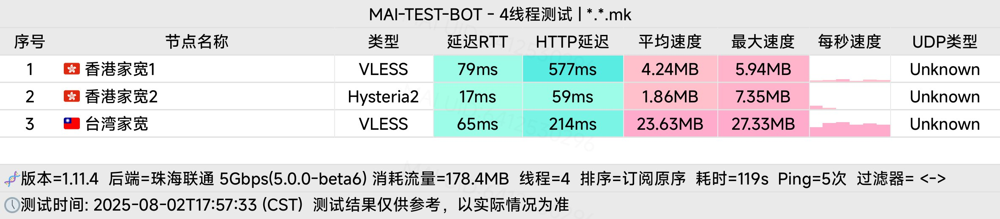
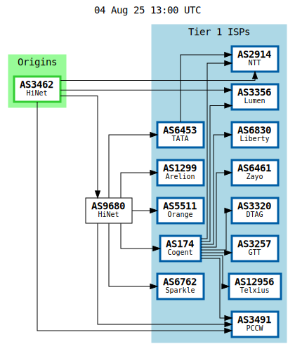
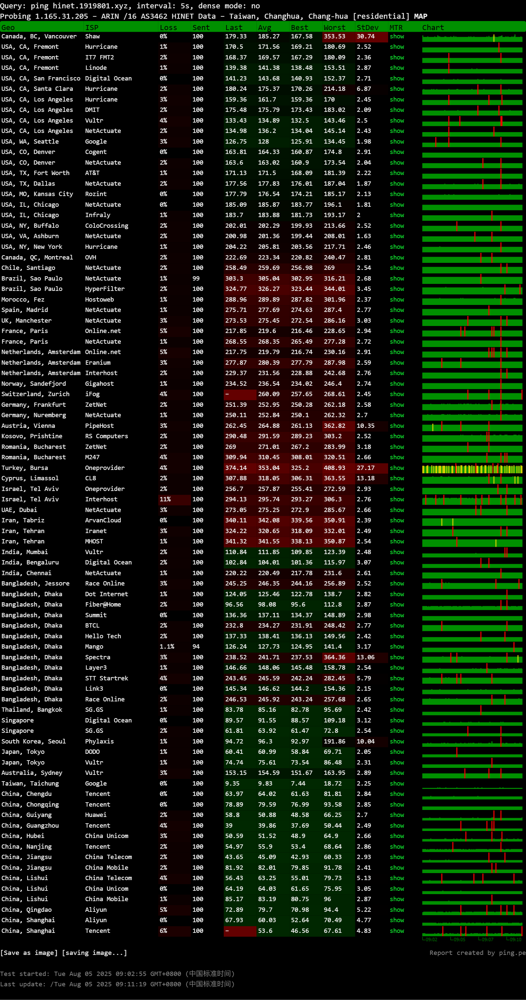

简评:三网直连,流媒体解锁,IP质量优秀,速度一般
<!-- more -->

### IP 质量检测

**数据库编号说明：**

| 编号 | 数据库来源 |
| :-- | :--- |
| `[0]` | ipinfo数据库 |
| `[1]` | scamalytics数据库 |
| `[2]` | virustotal数据库 |
| `[3]` | abuseipdb数据库 |
| `[4]` | ip2location数据库 |
| `[5]` | ip-api数据库 |
| `[6]` | ipwhois数据库 |
| `[7]` | ipregistry数据库 |
| `[8]` | ipdata数据库 |
| `[9]` | db-ip数据库 |
| `[A]` | ipapiis数据库 |
| `[B]` | ipapicom数据库 |
| `[C]` | bigdatacloud数据库 |
| `[D]` | dkly数据库 |
| `[E]` | ipqualityscore数据库 |

#### IPV4

**安全得分：**

| 指标 | 值 | 数据库 | 说明 |
| :--- | :--- | :--- | :--- |
| 声誉 | 0 | `[2]` | 越高越好 |
| 信任得分 | 33 | `[8]` | 越高越好 |
| VPN得分 | 0 | `[8]` | 越低越好 |
| 代理得分 | 100 | `[8]` | 越低越好 |
| 社区投票-无害 | 0 | `[2]` | |
| 社区投票-恶意 | 0 | `[2]` | |
| 威胁得分 | 100 | `[8]` | 越低越好 |
| 欺诈得分 | 1 (`[1]`), 28 (`[E]`) | | 越低越好 |
| 滥用得分 | 0 | `[3]` | 越低越好 |
| ASN滥用得分 | 0.0013 (Low) | `[A]` | 越低越好 |
| 公司滥用得分 | 0.01 (Elevated) | `[A]` | 越低越好 |
| 威胁级别 | low | `[9]` | |

**黑名单记录统计：**

| 记录类型 | 数量 | 数据库 |
| :--- | :--- | :--- |
| 无害记录数 | 0 | `[2]` |
| 恶意记录数 | 0 | `[2]` |
| 可疑记录数 | 0 | `[2]` |
| 无记录数 | 94 | `[2]` |

**安全信息：**

| 属性 | 值 | 数据库 |
| :--- | :--- | :--- |
| 使用类型 | FixedLineISP, business, isp, hosting - high probability, corporate | `[3, 8, 0, 7, A, C, 9]` |
| 公司类型 | isp | `[0, 7, A]` |
| 是否云提供商 | No | `[7]` |
| 是否数据中心 | No | `[0, 1, 5, 6, 8, A, C]` |
| 是否移动设备 | No (`[5, A, C]`), Yes (`[E]`) | |
| 是否代理 | No | `[0, 1, 4, 5, 6, 7, 8, 9, A, C, E]` |
| 是否VPN | No | `[0, 1, 6, 7, A, C, E]` |
| 是否TorExit/Tor出口 | No | `[1, 7]` |
| 是否网络爬虫 | No | `[9, A, E]` |
| 是否匿名 | No | `[1, 6, 7, 8]` |
| 是否攻击者 | No | `[7, 8]` |
| 是否滥用者 | No | `[7, 8, A, C, E]` |
| 是否威胁 | No | `[7, 8, C]` |
| 是否中继 | No | `[0, 7, 8, C]` |
| 是否Bogon | No | `[7, 8, A, C]` |
| 是否机器人 | No | `[E]` |
| DNS-黑名单 | Total_Check: 315, Clean: 0, Blacklisted: 6, Other: 20 | |

#### IPV6

**安全得分：**

| 指标 | 值 | 数据库 | 说明 |
| :--- | :--- | :--- | :--- |
| 欺诈得分 | 2 | `[1]` | 越低越好 |
| 滥用得分 | 0 | `[3]` | 越低越好 |
| ASN滥用得分 | 0.0013 (Low) | `[A]` | 越低越好 |
| 公司滥用得分 | 0 (Very Low) | `[A]` | 越低越好 |

**安全信息：**

| 属性 | 值 | 数据库 |
| :--- | :--- | :--- |
| 使用类型 | isp, FixedLineISP | `[A, 3]` |
| 公司类型 | isp | `[A]` |
| 是否数据中心 | No | `[1, A]` |
| 是否移动设备 | No | `[A]` |
| 是否代理 | No | `[1, A]` |
| 是否VPN | No | `[1, A]` |
| 是否Tor | No | `[1, 3, A]` |
| 是否Tor出口 | No | `[1]` |
| 是否网络爬虫 | No | `[A]` |
| 是否匿名 | No | `[1]` |
| 是否滥用者 | No | `[A]` |
| 是否Bogon | No | `[A]` |
| DNS-黑名单 | Total_Check: 315, Clean: 0, Blacklisted: 0, Other: 315 | |

### 上游及回程线路检测

| 探测地点 | IP地址 | 线路类型 |
| :------- | :------- | :------- |
| 北京电信v4 | 219.141.140.10 | 电信163 [普通线路] |
| 北京联通v4 | 202.106.195.68 | 联通4837 [普通线路] |
| 北京移动v4 | 221.179.155.161 | 检测不到回程路由节点的IPV4地址 |
| 上海电信v4 | 202.96.209.133 | 电信163 [普通线路] |
| 上海联通v4 | 210.22.97.1 | 联通4837 [普通线路] |
| 上海移动v4 | 211.136.112.200 | 移动CMI [普通线路] |
| 广州电信v4 | 58.60.188.222 | 电信163 [普通线路] |
| 广州联通v4 | 210.21.196.6 | 联通4837 [普通线路] |
| 广州移动v4 | 120.196.165.24 | 移动CMI [普通线路] |
| 成都电信v4 | 61.139.2.69 | 电信163 [普通线路] |
| 成都联通v4 | 119.6.6.6 | 联通4837 [普通线路] |
| 成都移动v4 | 211.137.96.205 | 移动CMI [普通线路] |
| 北京电信v6 | 2400:89c0:1053:3::69 | 检测不到回程路由节点的IPV6地址 |
| 北京联通v6 | 2400:89c0:1013:3::54 | 检测不到回程路由节点的IPV6地址 |
| 北京移动v6 | 2409:8c00:8421:1303::55 | 检测不到回程路由节点的IPV6地址 |
| 上海电信v6 | 240e:e1:aa00:4000::24 | 检测不到回程路由节点的IPV6地址 |
| 上海联通v6 | 2408:80f1:21:5003::a | 检测不到回程路由节点的IPV6地址 |
| 上海移动v6 | 2409:8c1e:75b0:3003::26 | 检测不到回程路由节点的IPV6地址 |
| 广州电信v6 | 240e:97c:2f:3000::44 | 电信163 [普通线路] |
| 广州联通v6 | 2408:8756:f50:1001::c | 联通4837 [普通线路] |
| 广州移动v6 | 2409:8c54:871:1001::12 | 移动CMI [普通线路] |

### 国际互连
#### ISP

#### 全球ping


### 三网去程路由
#### 广州电信
| 跳数 | IP | PTR | 地理位置 / 仅供参考 | AS | 丢包率 | 发包 | 最新(ms) | 最快(ms) | 最慢(ms) | 平均(ms) |
|---|---|---|---|---|---|---|---|---|---|---|
| 1 | -- | -- | -- | -- | 100% | 34 | * | -- | -- | -- |
| 2 | 192.168.233.2 | -- | 局域网 | -- | 42% | 57 | 10 | 1 | 17 | 6 |
| 3 | 172.30.0.1 | -- | 局域网 | -- | 0% | 94 | 4 | <1 | 14 | 4 |
| 4 | 172.31.53.6 | -- | 局域网 | -- | 50% | 52 | * | 3 | 20 | 7 |
| 5 | 172.17.31.229 | -- | 局域网 | -- | 0% | 99 | 17 | 1 | 22 | 7 |
| 6 | 192.168.1.33 | -- | 局域网 | -- | 2% | 93 | 8 | 3 | 17 | 7 |
| 7 | -- | -- | -- | -- | 100% | 35 | * | -- | -- | -- |
| 8 | -- | -- | -- | -- | 100% | 35 | * | -- | -- | -- |
| 9 | 14.215.42.53 | -- | 中国/广东/广州/电信 | AS4134 | 78% | 40 | 8 | 3 | 8 | 5 |
| 10 | 121.14.14.45 | -- | 中国/广东/广州/电信 | AS4134 | 1% | 93 | 9 | 3 | 40 | 8 |
| 11 | 113.96.4.49 | -- | 中国/广东/广州/电信 | AS4134 | 92% | 36 | * | 3 | 12 | 7 |
| 12 | 202.97.93.89 | -- | 骨干网/电信 | AS4134 | 61% | 46 | 8 | 2 | 8 | 4 |
| 13 | 202.97.66.225 | -- | 骨干网/电信 | AS4134 | 64% | 45 | * | 3 | 10 | 5 |
| 14 | 202.97.33.42 | -- | 骨干网/电信 | AS4134 | 2% | 94 | * | 38 | 46 | 38 |
| 15 | 220.128.30.53 | 220-128-30-53.pcpd-4116.hi... | 中国/台湾/台北/cht.com.tw | AS1659 | 1% | 95 | 31 | 29 | 37 | 29 |
| 16 | -- | -- | -- | -- | 100% | 36 | * | -- | -- | -- |
| 17 | 220.128.13.49 | 220-128-13-49.chch-3032.hi... | 中国/台湾/台北/cht.com.tw | AS1659 | 8% | 85 | * | 32 | 39 | 32 |
| 18 | 220.128.20.97 | 220-128-20-97.chch-3332.hi... | 中国/台湾/cht.com.tw | AS1659 | 3% | 91 | 33 | 32 | 38 | 32 |
| 19 | 168.95.157.13 | h13.s157.ts.hinet.net | 中国/台湾/彰化/cht.com.tw | AS3462 | 2% | 95 | * | 32 | 39 | 32 |
| 20 | -- | -- | -- | -- | 100% | 35 | * | -- | -- | -- |
| 21 | 1.165.31.205 | 1-165-31-205.dynamic-ip.hin... | 中国/台湾/彰化/cht.com.tw | AS3462 | 5% | 88 | 33 | 33 | 50 | 35 |
#### 广州联通
| 跳数 | IP | PTR | 地理位置 / 仅供参考 | AS | 丢包率 | 发包 | 最新(ms) | 最快(ms) | 最慢(ms) | 平均(ms) |
|---|---|---|---|---|---|---|---|---|---|---|
| 1 | 27.44.127.129 | -- | 中国/广东/广州/联通 | AS134543 | 0% | 100 | 6 | 1 | 15 | 4 |
| 2 | 192.168.66.1 | -- | 局域网 | -- | 0% | 100 | 6 | 2 | 12 | 5 |
| 3 | 172.20.0.1 | -- | 局域网 | -- | 0% | 100 | 3 | 2 | 13 | 4 |
| 4 | 10.128.16.29 | -- | 局域网 | -- | 21% | 72 | * | 4 | 26 | 7 |
| 5 | 29.18.226.144 | -- | 美国 | AS749 | 0% | 100 | 4 | 2 | 16 | 4 |
| 6 | 29.18.226.144 | -- | 美国 | AS749 | 0% | 100 | 2 | 2 | 9 | 4 |
| 7 | 30.1.157.149 | -- | 美国 | AS749 | 92% | 37 | * | 3 | 4 | 3 |
| 8 | 1.165.31.205 | 1-165-31-205.dynamic-ip.hi... | 中国/台湾/彰化/cht.com.tw | AS3462 | 0% | 100 | 50 | 48 | 66 | 49 |
#### 广州移动
| 跳数 | IP | PTR | 地理位置 / 仅供参考 | AS | 丢包率 | 发包 | 最新(ms) | 最快(ms) | 最慢(ms) | 平均(ms) |
|---|---|---|---|---|---|---|---|---|---|---|
| 1 | 183.232.3.1 | -- | 中国/广东/广州/移动 | AS56040 | 0% | 100 | 7 | 2 | 44 | 11 |
| 2 | -- | -- | -- | -- | 100% | 36 | * | -- | -- | -- |
| 3 | 192.168.88.46 | -- | 局域网 | -- | 0% | 100 | 6 | 4 | 36 | 11 |
| 4 | 10.0.7.49 | -- | 局域网 | -- | 0% | 100 | 5 | 1 | 39 | 12 |
| 5 | 211.136.242.109 | -- | 中国/广东/广州/移动 | AS56040 | 0% | 100 | 4 | 4 | 33 | 13 |
| 6 | 221.183.39.169 | -- | 骨干网/移动 | AS9808 | 92% | 37 | * | 5 | 18 | 11 |
| 7 | 221.183.89.241 | -- | 骨干网/移动 | AS9808 | 0% | 100 | 18 | 5 | 38 | 13 |
| 8 | 221.183.92.22 | -- | 骨干网/移动 | AS9808 | 0% | 100 | 7 | 5 | 48 | 14 |
| 9 | 221.183.55.57 | -- | 骨干网/移动 | AS9808 | 0% | 100 | 21 | 15 | 37 | 19 |
| 10 | 223.120.2.9 | -- | 骨干网/移动 | AS58453 | 74% | 43 | * | 14 | 25 | 18 |
| 11 | 223.120.2.54 | -- | 骨干网/移动 | AS58453 | 45% | 56 | * | 18 | 40 | 21 |
| 12 | 211.22.33.238 | 211-22-33-238.tpdt-4013.hi... | 中国/台湾/台北/cht.com.tw | AS3462 | 1% | 99 | 39 | 37 | 308 | 45 |
| 13 | 220.128.30.234 | 220-128-30-234.tpdt-4123.h... | 中国/台湾/台北/cht.com.tw | AS1659 | 0% | 99 | 44 | 39 | 57 | 41 |
| 14 | 220.128.1.42 | 220-128-1-42.tpdb-3031.hin... | 中国/台湾/台北/cht.com.tw | AS1659 | 38% | 58 | 42 | 42 | 52 | 44 |
| 15 | -- | -- | -- | -- | 100% | 35 | * | -- | -- | -- |
| 16 | 220.128.18.41 | 220-128-18-41.chch-3031.hi... | 中国/台湾/cht.com.tw | AS1659 | 0% | 99 | 41 | 40 | 56 | 41 |
| 17 | 220.128.20.25 | 220-128-20-25.chch-3332.hi... | 中国/台湾/cht.com.tw | AS1659 | 0% | 100 | 40 | 40 | 51 | 41 |
| 18 | 168.95.157.13 | h13.s157.ts.hinet.net | 中国/台湾/彰化/cht.com.tw | AS3462 | 0% | 100 | 41 | 40 | 54 | 41 |
| 19 | -- | -- | -- | -- | 100% | 35 | * | -- | -- | -- |
| 20 | 1.165.31.205 | 1-165-31-205.dynamic-ip.hi... | 中国/台湾/彰化/cht.com.tw | AS3462 | 1% | 98 | 42 | 41 | 53 | 44 |
### 三网回程路由检测
#### 广州电信
```
ICMP v4 - traceroute to 58.60.188.222, 30 hops max, 52 byte packets
0.35 ms      *                           
0.82 ms      *                           
2.00 ms      AS3462     [HINET-NET]        中国, 台湾, 台北, hinet.net  中华电信
3.89 ms      AS3462     [HINET-NET]        中国, 台湾, 彰化, hinet.net  中华电信
4.85 ms      *          [HINET-NET]        中国, 台湾, 彰化, 中华电信
*
4.64 ms      *          [HINET-NET]        中国, 台湾省, 台北市, 中华电信
4.16 ms      *          [HINET-NET]        中国, 台湾, 台北市
33.93 ms     AS4134     [CHINANET-BB]      中国, 广东, 广州, www.chinatelecom.com.cn  电信
90.10 ms     AS4134     [CHINANET-BB]      中国, 上海, www.chinatelecom.com.cn  电信
*
160.96 ms    AS134774   [CHINANET-GD]      中国, 广东, 深圳, chinatelecom.cn  电信
*
```
#### 广州联通
```
ICMP v4 - traceroute to 210.21.196.6, 30 hops max, 52 byte packets
0.51 ms      *                           
0.58 ms      *                           
1.83 ms      AS3462     [HINET-NET]        中国, 台湾, 台北, hinet.net  中华电信
2.33 ms      AS3462     [HINET-NET]        中国, 台湾, 彰化, hinet.net  中华电信
6.30 ms      *          [HINET-NET]        中国, 台湾, 彰化
*
4.18 ms      *          [HINET-NET]        中国, 台湾, 台北市
6.64 ms      *          [HINET-NET]        中国, 台湾, 台北市
27.57 ms     AS4837     [CU169-BACKBONE]   中国, 广东, 广州, chinaunicom.cn  联通
79.19 ms     AS4837     [CU169-BACKBONE]   中国, 广东, 广州, chinaunicom.cn  联通
*
270.14 ms    AS17623    [APNIC-AP]         中国, 广东, 深圳, chinaunicom.cn  联通
33.21 ms     AS17623                       中国, 广东, 深圳, chinaunicom.cn  联通
```
#### 广州移动
```
ICMP v4 - traceroute to 120.196.165.24, 30 hops max, 52 byte packets
0.43 ms      *                           
0.79 ms      *                           
1.57 ms      AS3462     [HINET-NET]        中国, 台湾, 台北, hinet.net  中华电信
1.75 ms      AS3462     [HINET-NET]        中国, 台湾, 彰化, hinet.net  中华电信
4.09 ms      *          [HINET-NET]        中国, 台湾, 彰化
*
55.52 ms     *          [HINET-NET]        中国, 中国台湾, 台北市, hinet.net  中华电信
4.17 ms      *          [HINET-NET]        中国, 台湾, 台北, hinet.net  中华电信
6.88 ms      *          [HINET-NET]        中国, 台湾, 台北, 中华电信
29.75 ms     AS3462     [HINET-NET]        中国, 香港, hinet.net  中华电信
26.96 ms     AS58453    [CMI-INT]          中国, 香港, cmi.chinamobile.com  移动
32.48 ms     AS58453    [CMI-INT]          中国, 广东, 广州, cmi.chinamobile.com  移动
36.71 ms     AS9808     [CMNET]            中国, 广东, 广州, chinamobileltd.com  移动
31.43 ms     AS9808     [CMNET]            中国, 广东, 广州, chinamobileltd.com  移动
33.21 ms     AS9808     [CMNET]            中国, 广东, 广州, chinamobileltd.com  移动
33.32 ms     AS9808     [CMNET]            中国, 广东, 广州, chinamobileltd.com  移动
37.58 ms     AS9808     [CMNET]            中国, 广东, 广州, chinamobileltd.com  移动
93.62 ms     AS56040    [APNIC-AP]         中国, 广东, 深圳, gd.10086.cn  移动
```

### 就近节点测速

| 位置 | 上传速度 | 下载速度 | 延迟 | 丢包率 |
| :--- | :------- | :------- | :--- | :--- |
| 中国香港 | 230.44 Mbps | 519.05 Mbps | 60.87 ms | 2.3% |
| 洛杉矶 | 188.86 Mbps | 494.39 Mbps | 133.59 ms | 0.0% |
| 新加坡 | 178.41 Mbps | 155.60 Mbps | 174.26 ms | 0.0% |
| 法兰克福 | 151.58 Mbps | 501.72 Mbps | 278.52 ms | 2.0% |
| 日本东京 | 37.95 Mbps | 15.30 Mbps | 204.64 ms | 22.0% |

---

### 解锁测试

### 御三家流媒体解锁

#### Netflix

| IP 类型 | 解锁状态 | 识别地域信息 |
| :------ | :------- | :----------- |
| IPV4 | 完整解锁Netflix，支持非自制剧的观看 | 中国台湾 |
| IPV6 | 完整解锁Netflix，支持非自制剧的观看 | 中国台湾 |

#### Youtube

| IP 类型 | 连接方式 | ISP运营商 | 视频缓存节点地域 | Youtube识别地域 |
| :------ | :------- | :-------- | :--------------- | :-------------- |
| IPV4 | Google Global CacheCDN (ISP Cooperation) | HINET | TXG(TXG9) | 中国台湾(TW) |
| IPV6 | Google Global CacheCDN (ISP Cooperation) | HINET | TXG(TXG9) | 中国台湾(TW) |

#### DisneyPlus

| IP 类型 | 解锁状态 |
| :------ | :------- |
| IPV4 | 当前IPv4出口所在地区即将开通DisneyPlus |
| IPV6 | 当前IPv4出口所在地区即将开通DisneyPlus |

### 跨国流媒体解锁

#### IPV4

| 平台 | 解锁状态 | 额外信息 |
| :--------------- | :------- | :------- |
| Apple | YES | Region: TWN |
| BingSearch | NO | Network Err |
| Claude | YES | |
| Dazn | YES | Region: TW |
| Disney+ | YES | Region: TW |
| Gemini | YES | Region: TW |
| GoogleSearch | Unknown | check www.google.com failed with code: 429 |
| Google Play Store | YES | Region: TW |
| IQiYi | YES | Region: TW |
| Instagram Licensed Audio | YES | |
| KOCOWA | NO | |
| MetaAI | NO | GeoBlocked |
| Netflix | YES | Region: US |
| Netflix CDN | TW | |
| OneTrust | YES | Region: TW TAIWAN |
| ChatGPT | YES | Region: TW |
| Paramount+ | YES | |
| Amazon Prime Video | YES | Region: TW |
| Reddit | YES | |
| SonyLiv | NO | Network Err |
| Sora | YES | Region: TW |
| Spotify Registration | YES | Region: TW |
| Steam Store | YES | Community Available (Region: TW) |
| TVBAnywhere+ | YES | Region: TW |
| TikTok | YES | Region: TW |
| Viu.com | YES | |
| Wikipedia Editability | YES | |
| YouTube Region | YES | Region: TW |
| YouTube CDN | hinet - TXG | |